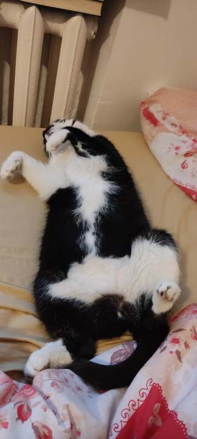

# Kitty OS Project
KittyOS is meant to be a silly non-unix operating system for cat lovers and cats themselves.
There's still work going on with the kernel, drivers, APIs, etc.
We're open for new pull requests and contributions from anyone!

